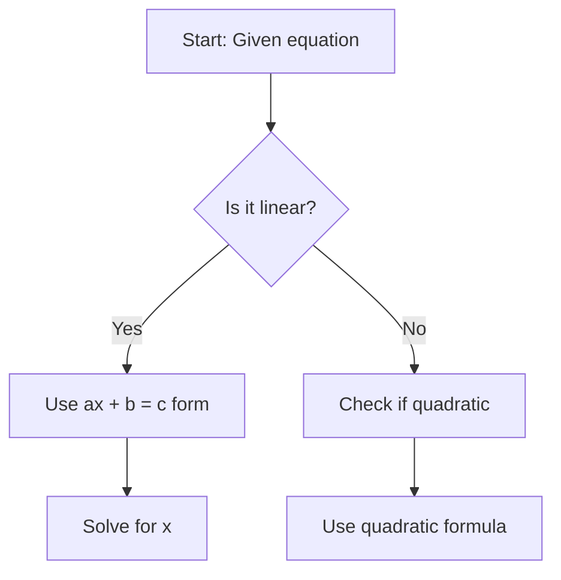

# Math Visualizer

This skill creates high-quality visual assets for math quiz questions, including interactive graphs, geometric diagrams, static images, and Mafs.js configurations.

## When to Use

Activate this skill when:
- Quiz questions need visual aids (graphs, diagrams, shapes)
- User requests interactive math visualizations
- Questions involve graphing functions or geometric constructions
- Need to create Mafs.js configuration for React components
- Generating SVG diagrams or PNG images for math concepts

## Supported Visualization Types

### 1. Interactive Graphs (Mafs.js Config)
Generate JSON configuration for Mafs.js React components:
- Cartesian coordinate systems
- Polar coordinates
- Function plots (polynomial, trigonometric, exponential)
- Points, vectors, and shapes
- Interactive elements

### 2. Static Graphs (PNG/SVG)
Use matplotlib to create publication-quality graphs:
- Function graphs
- Data plots (scatter, bar, line)
- Statistical distributions
- Calculus visualizations (derivatives, integrals)

### 3. Geometric Diagrams (SVG)
Create scalable vector graphics for geometry:
- Triangles, circles, polygons
- Angle measurements
- Constructions and proofs
- 3D projections

### 4. Mermaid Diagrams
For flowcharts and conceptual diagrams:
- Problem-solving workflows
- Decision trees
- Concept maps

## Visualization Workflow

### Step 1: Analyze Requirements
From the question's `visualAssets` field, determine:
- Type of visualization needed
- Mathematical content to display
- Interactivity requirements
- Output format (Mafs config, PNG, SVG, Mermaid)

### Step 2: Create Mafs.js Configuration

For interactive graphs, generate JSON config:

```json
{
  "type": "cartesian",
  "viewBox": {
    "x": [-10, 10],
    "y": [-10, 10]
  },
  "preserveAspectRatio": true,
  "elements": [
    {
      "type": "plot",
      "function": "x => x**2",
      "color": "#3b82f6",
      "label": "f(x) = x²"
    },
    {
      "type": "point",
      "coordinates": [2, 4],
      "label": "A",
      "color": "#ef4444"
    },
    {
      "type": "vector",
      "tail": [0, 0],
      "tip": [3, 4],
      "color": "#10b981"
    }
  ]
}
```

Save to: `quizzes/[topic]/[quiz-name]/mafs-[question-id].json`

### Step 3: Generate Static Images

For matplotlib graphs:

```python
# Use the provided script
python .claude/skills/math-visualizer/scripts/create_graph.py \
  --function "lambda x: x**2" \
  --xrange -5 5 \
  --yrange 0 25 \
  --output quizzes/algebra/quiz-name/graph-001.png
```

Or create inline:

```python
import matplotlib.pyplot as plt
import numpy as np

x = np.linspace(-5, 5, 100)
y = x**2

plt.figure(figsize=(8, 6), dpi=150)
plt.plot(x, y, 'b-', linewidth=2, label='f(x) = x²')
plt.grid(True, alpha=0.3)
plt.xlabel('x')
plt.ylabel('f(x)')
plt.title('Quadratic Function')
plt.legend()
plt.savefig('output.png', bbox_inches='tight')
```

### Step 4: Create SVG Diagrams

For geometric shapes:

```python
python .claude/skills/math-visualizer/scripts/create_geometry.py \
  --shape triangle \
  --points "0,0" "4,0" "2,3" \
  --labels "A" "B" "C" \
  --output diagram.svg
```

Or use SVG templates in `templates/` directory.

### Step 5: Generate Mermaid Diagrams

For flowcharts and trees:

````markdown

````

## Output Organization

Store visual assets in quiz-specific folders:

```
quizzes/[topic]/[quiz-name]/
├── quiz.md
├── graph-001.png
├── graph-002.svg
├── mafs-config-001.json
├── mafs-config-002.json
└── diagram-triangle.svg
```

Reference in markdown:
```markdown


**Interactive Graph:**
```json:mafs
@import ./quiz-name/mafs-config-001.json
```
````

## Mafs.js Element Types

### Coordinates
```json
{"type": "coordinates", "variant": "cartesian" | "polar"}
```

### Plot Function
```json
{
  "type": "plot",
  "function": "x => Math.sin(x)",
  "color": "#3b82f6",
  "lineWidth": 2,
  "label": "y = sin(x)"
}
```

### Point
```json
{
  "type": "point",
  "coordinates": [2, 3],
  "label": "P",
  "color": "#ef4444"
}
```

### Vector
```json
{
  "type": "vector",
  "tail": [0, 0],
  "tip": [3, 4],
  "color": "#10b981",
  "label": "v"
}
```

### Circle
```json
{
  "type": "circle",
  "center": [0, 0],
  "radius": 5,
  "color": "#8b5cf6",
  "filled": false
}
```

### Line
```json
{
  "type": "line",
  "point1": [0, 0],
  "point2": [5, 5],
  "color": "#f59e0b",
  "style": "dashed"
}
```

### Polygon
```json
{
  "type": "polygon",
  "points": [[0,0], [4,0], [2,3]],
  "color": "#ec4899",
  "filled": true,
  "fillOpacity": 0.3
}
```

### Text
```json
{
  "type": "text",
  "position": [1, 1],
  "text": "Origin",
  "color": "#000000"
}
```

## Best Practices

1. **Use interactive graphs when possible**: Mafs.js provides better learning experience
2. **Optimize image size**: Use appropriate DPI (150 for web, 300 for print)
3. **Consistent color scheme**: Use project colors for visual coherence
4. **Include labels and legends**: Make graphs self-explanatory
5. **Test Mafs configs**: Ensure JSON is valid and renders correctly
6. **Keep SVG files clean**: Use simple paths for faster rendering
7. **Provide alt text**: Describe visuals for accessibility

## Common Graph Types

### Polynomial Functions
```python
# Quadratic: ax² + bx + c
# Cubic: ax³ + bx² + cx + d
```

### Trigonometric Functions
```python
# sin(x), cos(x), tan(x)
# Phase shifts and amplitude changes
```

### Exponential/Logarithmic
```python
# e^x, ln(x), log(x)
```

### Piecewise Functions
```python
# Different expressions for different domains
```

### Geometric Shapes
- Triangles (right, equilateral, isosceles)
- Circles and sectors
- Polygons
- 3D projections (cylinder, cone, sphere)

## Error Handling

If visualization fails:
- Check mathematical expression syntax
- Validate coordinate ranges (no division by zero)
- Ensure libraries are installed (matplotlib, numpy)
- Fall back to simpler visualization if complex one fails
- Provide text description as alternative

## Supporting Scripts

- `scripts/create_graph.py`: Generate matplotlib graphs
- `scripts/create_geometry.py`: Create geometric SVG diagrams
- `scripts/validate_mafs.py`: Validate Mafs.js configuration
- `templates/mafs_templates.json`: Pre-built Mafs configurations
- `templates/svg_shapes.svg`: SVG templates for common shapes
